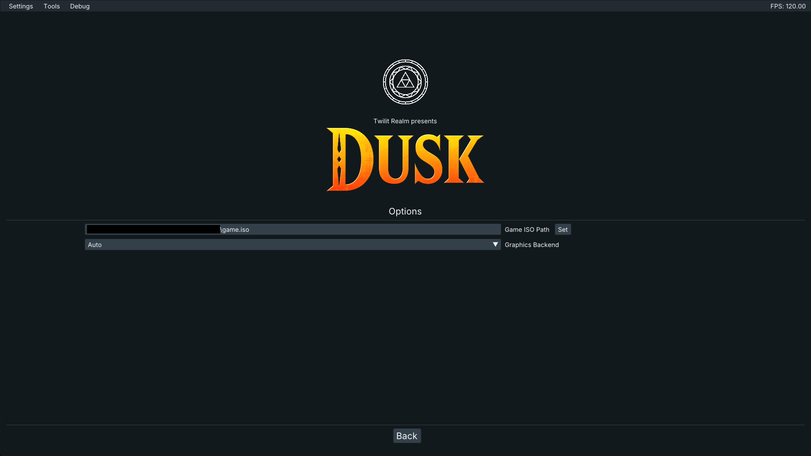

- ### **[Official Website](https://twilitrealm.dev)**
- ### **[Discord](https://discord.gg/QACynxeyna)**

# Overview
Dusk is a reverse-engineered reimplementation of Twilight Princess.
It aims to be as accurate as possible to the original while also providing new options, enhancements, and tools to customize your experience.

# Setup
**⚠️ Dusk does NOT provide any copyrighted assets. You must provide your own copy of the game.**

### 1. Verify your ROM dump
First make sure your dump of the game is clean and supported by Dusk. You can do this by checking the sha1 hash of your dump against this list of supported versions.

| Version      | sha1 hash                                |
|--------------| ---------------------------------------- |
| GameCube USA | 75edd3ddff41f125d1b4ce1a40378f1b565519e7 |
| GameCube PAL | 2601822a488eeb86fb89db16ca8f29c2c953e1ca |

### 2. Download [Dusk](https://github.com/TwilitRealm/dusk/releases)

### 3. Setup the game
- Extract the zip folder
- Launch Dusk
- Select Options, then set the ISO Path to your supported game dump
- Press Start Game to play!

# Building
If you'd like to build Dusk from source, please read the [build instructions](docs/building.md).

Pull Requests are welcomed! Note that we do not accept contributions that are primarily AI generated and will close your PR if we suspect as much.

# Credits
Special thanks to the [TP decompilation](https://github.com/zeldaret/tp) team, the GC/Wii decompilation community, the [Aurora](https://github.com/encounter/aurora) developers, the [TP speedrunning community](https://zsrtp.link), and all [contributors](https://github.com/TwilitRealm/dusk/graphs/contributors).
